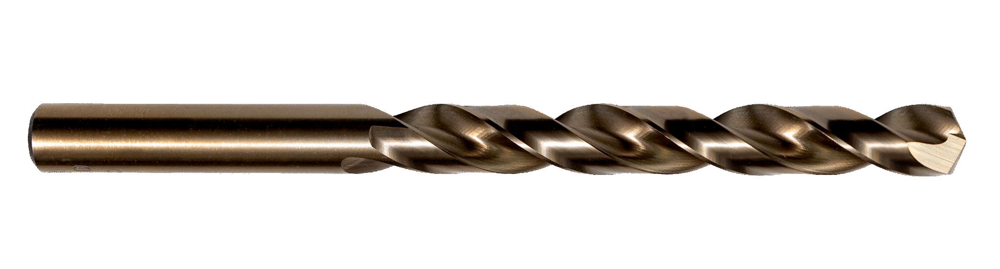

<!-- This page was contributed by:  Eli Uva-->
# Hole Sizes

Using standards to my your life easier.

<!-- Add a page image to make it pretty! -->

Typically hole sizes are defined by diameter, which is the full across dimension of a circle

## Hole types

There are multiple kinds of holes that are often used.

!!! Info "Through Holes"
    - Holes that are drilled all the way "through" a piece of material
    - Typically used for something to fit inside it like a bolt, rivet, or bearing

!!! Info "Blind Holes"
    - Holes that are only drilled partially through a material

!!! Info "Tapped Holes"
    - Through holes, or Blind holes that have been "tapped", to add internal threads
    - These threads allow screws to be screwed in
    - Commonly used on thunderhex 

!!! Info "Countersunk Holes"
    - Holes with a conical, opening to allow countersunk hardware to fit flush with the material face
    - Commonly used to house countersunk bolts

Holes are typically drilled out made by hand drills, drill presses, mills, or routers
<!-- TODO: Add links to drilling tools -->
Some common drill bit sizes we use are:

- 3/16" (0.1875")
- 5/32" (0.15625")
- 1/4" (0.25")
- 3/8" (0.375")

Each hole has a certain diameter corresponding to its purpose.
<!-- TODO: Add links to drill/tap chart -->
!!! Example
    A hex bearing has a 1.125" OD (Outer diameter) so the its hole to fit in would be 1.125" 
