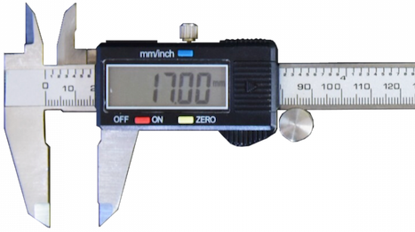

<!-- This page was contributed by:  Eli Uva-->
# Mechanical Math

Using math to my your life easier.

<!-- Add a page image to make it pretty! -->

## Standards

It is important to always use standardized measurements for everything we do so every part is easy to make, and later modify.

We typically work with measurements that are [**Imperial** (Inches)](#imperial), but sometimes we will have to work with parts that are in the **Metric** system (Millimeters).

<!-- TODO: Add links to measuring tools -->

There is a wide range of measurement tools such as: [Rulers](../Tools/Measuring%20Tools.md#rulers), [Tape Measures](../Tools/Measuring%20Tools.md#tape-measures), Calipers, and Micrometers

!!! warning
    It is important to use an **imperial tool when working on a imperial part** and a **metric tool when working on a metric part**.

### Imperial

Many imperial measurements are based on fractions of inches, or thousandths of inches

Some standard fraction imperial measurements that are commonly used are:

- **1/16in** (0.0625)
- **1/8in** (0.125)
- **3/16in** (0.1875)
- **1/4in** (0.25)
- **1/2in** (0.5)
- **3/4in** (0.75)
- **1in**

!!! Tip
    Memorizing these decimal values will be very helpful.

Some more precise measurements are: 

- **3/8in** (0.375)
- **5/8in** (0.675)
- **7/8in** (0.875)

To find measurements we will often use a **Tape Measure**, or useful a tool called a **Caliper**, that will give more precise digital measurements
