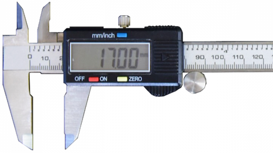
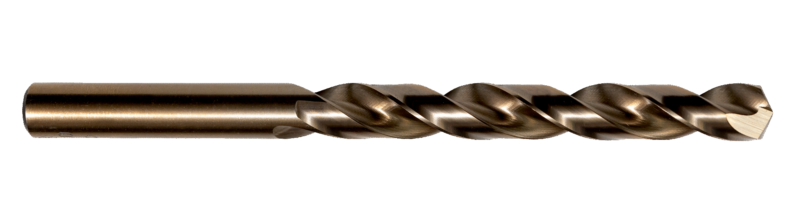

<!-- This page was contributed by:  -->
# Basic Mechanical - Introduction

The basics of mechanical

<!-- Add a page image to make it pretty! -->

## Overview

This section will help you learn the basics of FRC Mechanical.

**See table of contents for a breakdown of this section.**

***

## Basic Definitions and Concepts

- [Mechanical Math](../Core%20Concepts/Mechanical_Math.md)
    - Basics on the math that we commonly use in mechanical.
{: style="height:150px"}

- [Hole Sizes](../Core%20Concepts/Hole_Sizes.md)  
    - Basics on holes sizes.  
{: style="width:300px"}

- [Mechanical Resources](../Core%20Concepts/Resources.md)  
    - Good resources for Mechanical  
{: style="width:100px"}

- [Robot Requirements](../Core%20Concepts/Robot%20Requirements.md)  
    - TEXT  

- [General Design](../Core%20Concepts/Robot%20Design%20Overview.md)
    - TEXT

## Basics on Stock

## Basics on Hardware

## Basics on Mechanical Systems
