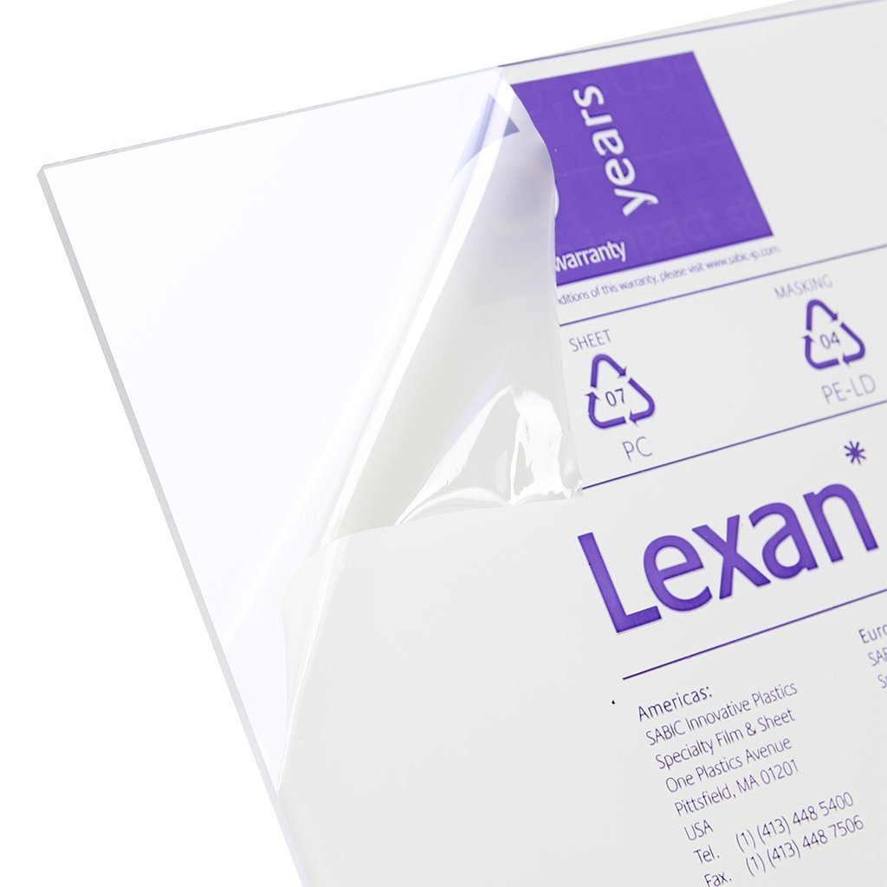
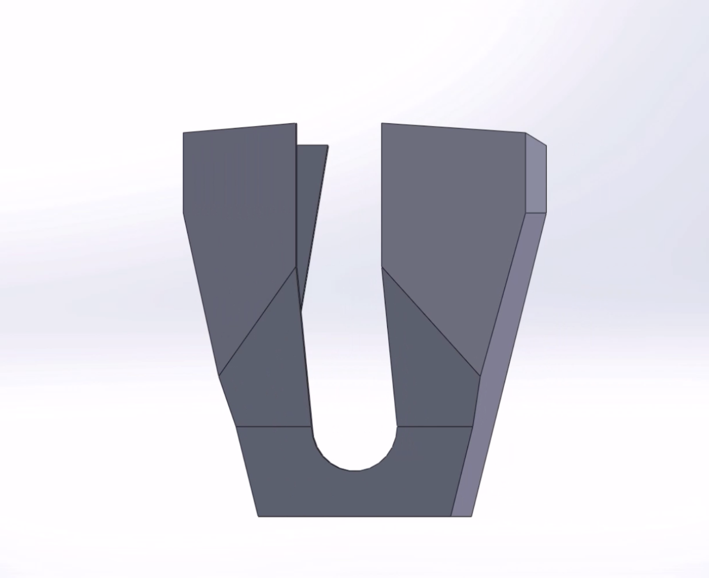

<!-- This page was contributed by:  -->
# Polycarbonate / Lexan

Using Lexan in your designs

<!-- Add a page image to make it pretty! -->

## Overview

- Polycarbonate is a type of light plastic that is quite flexible and does not shatter easily 
- Polycarbonate comes in large sheets, like sheet metal and is very easy to cut 
- Polycarbonate is used for commonly used light non structual parts, or parts that may face impacts due to its flexible non cracking or bending properties 
- You can intentionally bend lexan into shape, by heating it and molding it into different shapes, 
- Polycabronate can be bent into complex shapes that would be very difficult to make with other materials
- Polycarbonate is typiclly sold in large sheets measured by **Length**, **Width**, and **Thickness**
- Polycarbonate is also sold in round and square tubing

**See table of contents for a breakdown of this section.**

***

## Size

- The **Length** and **Width** of polycarbonate you buy should be based on how you will use it for parts
    - If you have a router, it is normally the most cost effective to buy the largest sheet that will fit on it
- The thickness of the sheet metal varies based on what its use is on the robot, and the thicker the lexan, the more ridgid
- Some common thickness include 
    - **1/16th"** (0.0625") Which is very flexible, and is commonly used on parts like walls of a hopper, or sponsor panels, and does not hold shape as well when bent 
    - **1/8"** (0.125") Which is relatively felxible, and is also commonly used on walls of a hopper or sponsor panels, but holds its shape very well when bent and allows you to create complex intriquite shapes
    - **1/4"** (0.25") Which is quite ridgid, is commonly used for things like intakes, or other parts that extend past you robots bumpers because they are very restistant to impacts and will not easily bend or break, 1/4" lexan also allows for standard Flanged Vex Bearings to be inserted into, however they can easy fall out if just pressed in

!! Warning
    When rivieting lexan, make sure to place a washer on the non mandrel side to ensure the lexan will not shatter when riveting

## Fabrication of Polycarbonate

- Polycarbonate is very versatile and can be cut, or bent to create many uses

### Cutting Polycarbonate

- Polycarbonate can be cut using many tools, such as a **Vertical Bandsaw**, **Jigsaw**, **CNC Router**, and even **Tin Snips**, if thin enough
- Polycarbonate can be cut on **CNC Routers** from CAD files, similiar to sheet metal
- Lexan can be lightweighted the same way aluminum can, however it is not very practical to cut 

!!! Tip
    This is a tip.
